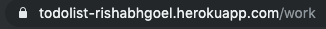
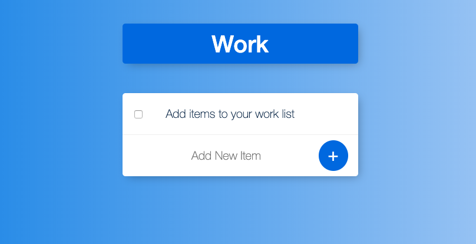

# TdlWithMongoDB

#### A Full Stack Lists Application to stay organized. Application has the ability to add as many custom lists as a user would like!

* [Go To Application!](https://todolist-rishabhgoel.herokuapp.com)

#### Default list will have the current date and time as the title. To create new custom lists, simply add a forward slash followed by whatever you would like to call the list in the url. This will create a new list with your custom title.

#### The default list will be rendered as such:

#### To create a custom list edit the url by adding after the '/' like this:

#### The custom list will now be rendered as such:

## Technologies used:

* Javascript
* Express Server
* Node
* MomentJS
* CSS
* EJS 
* MongoDB
* Mongoose

#### Made by Rishabh Goel